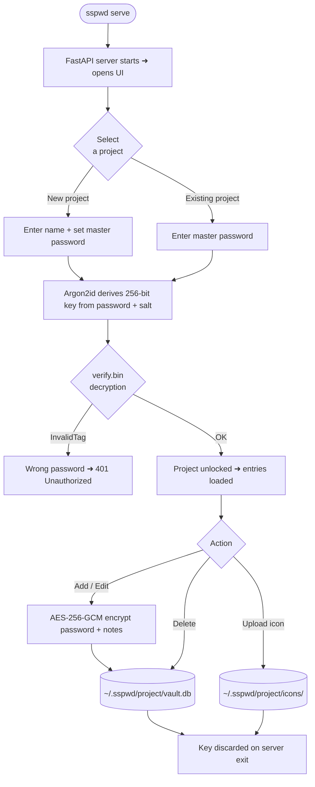

# sspwd – super secret password

[](https://www.python.org/downloads/)
[](https://opensource.org/licenses/MIT)
[](https://pypi.org/project/sspwd/)
[](https://github.com/yauheniya-ai/sspwd/actions/workflows/tests.yml)
[](https://github.com/yauheniya-ai/sspwd/actions/workflows/tests.yml)
[](https://github.com/yauheniya-ai/sspwd/commits/main)
[](https://pepy.tech/project/sspwd)

A local, encrypted password manager with a built-in web UI.

<p align="center">
  
  <em>Interactive UI to manage passwords</em>
</p>

Passwords are stored in `~/.sspwd/default/vault.db` — fully encrypted with a key
derived from your master password. Nothing leaves your machine.

## Tech Stack

**Backend**
-  Python — package language
-  FastAPI — REST API for the web UI
-  SQLite — local encrypted vault database
-  Argon2id + AES-256-GCM — key derivation and authenticated encryption
-  pytest — test suite with coverage reporting

**Frontend**
-  React — interactive UI
-  Vite — frontend build tool and dev server
-  TypeScript — type-safe components
-  Tailwind CSS — utility-first styling
-  Iconify — service and brand icons

**CLI**
-  Click — CLI commands (`serve`, `add`, `list`, `get`, `delete`, `projects`)

**Packaging**
-  PyPI — distributed as an installable Python package

## Installation

```bash
pip install sspwd
```

> Requires Python ≥ 3.10.

## Quick start

### Web UI

```bash
sspwd serve
```

Opens `http://127.0.0.1:7523` in your browser — **no password required at startup.** The UI launches in demo mode (`mockData`). Select a project from the dropdown to unlock it with its master password, or create a new one.

```
mockData        ← demo data, no password needed
default    🔒   ← click to unlock with master password
work       🔒   ← separate encrypted vault
+ new           ← create a new project
```

### CLI

```bash
# Start the server (opens browser automatically)
sspwd serve

# Start without opening the browser
sspwd serve --no-browser

# Work with a specific project
sspwd add --project work
sspwd list --project work
sspwd list --project work --search github

# Show a single entry by ID (reveals password)
sspwd get 3 --project work

# Delete an entry
sspwd delete 3 --project work

# List all existing projects
sspwd projects
```

> All CLI commands that access a vault will prompt for the master password.

## How it works



## Projects

Each project is a completely isolated, separately encrypted vault:

```
~/.sspwd/
├── default/          ← created automatically on first use
│   ├── vault.db      ← encrypted entries
│   ├── salt.bin      ← 32-byte random salt (unique per project)
│   ├── verify.bin    ← encrypted sentinel for password verification
│   └── icons/        ← uploaded custom icons
├── work/
│   └── ...
└── private/
    └── ...
```

Projects can have different master passwords. Switching between them in the UI prompts for the relevant password only once per server session.

## Security

| Detail | Value |
|---|---|
| Encryption | AES-256-GCM (authenticated — detects tampering via built-in auth tag) |
| Key derivation | [Argon2id](https://github.com/hynek/argon2-cffi) — memory-hard, OWASP 2024 recommended |
| Argon2id parameters | `time=3`, `memory=64 MiB`, `parallelism=2` |
| Key size | 256-bit |
| Nonce | 12 bytes, random per encryption call, never reused |
| Storage | SQLite (`~/.sspwd/{project}/vault.db`) |
| Key never stored | Derived in memory on unlock, discarded on server exit |

**Vault files explained**

| File | Purpose |
|---|---|
| `salt.bin` | 32 random bytes, generated once at vault creation. Makes your key unique to this vault — the same password on two vaults produces two completely different keys. Not a secret on its own. |
| `verify.bin` | A tiny AES-256-GCM encrypted blob containing a known plaintext. Decrypted on every unlock attempt — wrong password raises `InvalidTag` immediately, before any entry data is touched. |
| `vault.db` | SQLite database. `password` and `notes` fields are AES-256-GCM encrypted. Titles and usernames are stored in plaintext to support search. |
| `icons/` | User-uploaded icon files (PNG, SVG, WEBP), served locally by the FastAPI server. |

The master password is never stored anywhere. It is entered in the browser UI, used to derive the AES key via Argon2id, and the key lives only in process memory for the lifetime of the server session. Stopping `sspwd serve` discards it.

> **Backup:** Your vault is local only — there is no sync. Back it up with:
> ```bash
> rsync -av ~/.sspwd/ ~/path/to/backup/
> ```

## How sspwd compares

| | sspwd | Browser (Safari/Chrome) | 1Password / Bitwarden | macOS Keychain |
|---|---|---|---|---|
| Local-only | ✅ | ❌ cloud sync | ❌ cloud sync | ✅ |
| Open source | ✅ | ❌ | Bitwarden ✅ | ❌ |
| Audit the encryption source code | ✅ | ❌ | Bitwarden ✅ | ❌ |
| No account needed | ✅ | ❌ | ❌ | ✅ |
| Project / workspace isolation | ✅ | ❌ | ❌ | ❌ |
| Tags, categories, metadata | ✅ | ❌ | partial | ❌ |
| Custom icons | ✅ | ❌ | ✅ | ❌ |
| Browser autofill extension | ❌ | ✅ | ✅ | ✅ |

**Browser managers** (Safari Keychain, Chrome Passwords) sync to Apple/Google servers by default. Even with strong client-side encryption, you are trusting a corporation's infrastructure, account security, and update pipeline. Their browser extension autofill is also a real attack surface — extensions request access to read and modify all pages, making a compromised extension a universal credential harvester. In comparison, the copy-paste method is more deliberate and phishing-resistant.

**1Password / Bitwarden** are the closest conceptual relatives — master password, local encryption, structured entries. Bitwarden is open-source and self-hostable. Their advantage is cross-device sync and mobile apps; their disadvantage is mandatory account setup, cloud dependency (unless self-hosted), and no project isolation without a paid Teams plan.

**macOS Keychain** is local and OS-integrated but has no organisational structure, no web UI, is macOS-only, and is difficult to export or script against.

**sspwd's advantage** is zero setup, zero accounts, zero cloud, and the ability to keep personal, work, and project credentials in cleanly separated encrypted vaults — with a searchable, filterable UI accessible from any browser on localhost.

## Contributing

1. Fork the repository
2. Create a feature branch (`git checkout -b feature/my-change`)
3. Make your changes
4. Run the test suite: `pytest --cov=src --cov-report=term-missing`
5. Submit a pull request

## License

MIT — see [LICENSE](LICENSE).